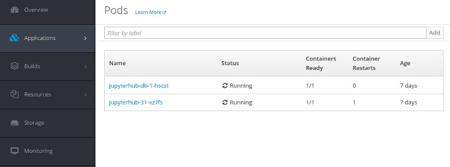
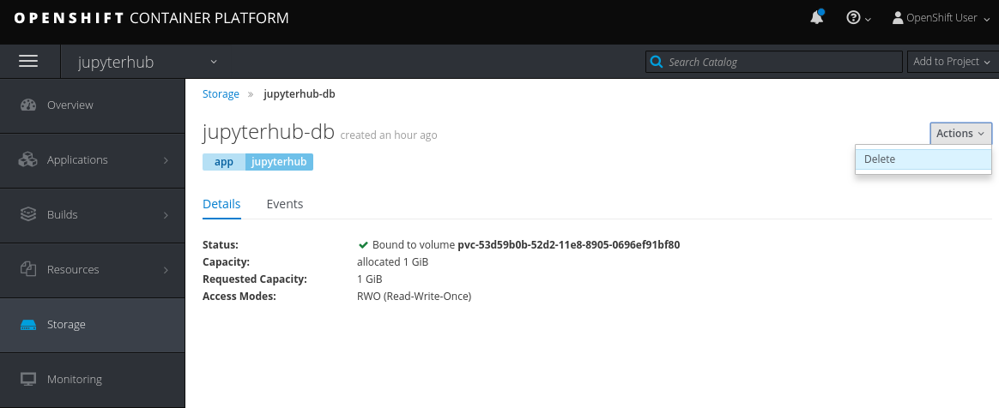

# Module - 2 : Setting up JupyterHub in OpenShift Container Platform

!!! Summary "Module Agenda"
    - **In this module you will be creating an OpenShift project for JupyterHub required for the rest of the sessions**

- From your workstation login to the ``OpenShift Master Node`` with the user name **``cloud-user``** and ``SSH Private Key`` [(Learn how to Login)](https://ksingh7.github.io/data-show/#accessing-the-lab)

```
chmod 400 <path to ssh_key.pem>
ssh -i <path to ssh_key.pem> cloud-user@<OpenShift Master Node IP Address>
```  

!!! example "Prerequisite"
    - You must run all the commands logged in as user **cloud-user** on the **OpenShift Master Node** node, unless otherwise specified. 

## Create an OpenShift Project

In order to save your precious lab time, OpenShift Container Platform has already been installed and configured. Before you begin with some data science exercises, let's create an OpenShift project.

- Login to OpenShift Master Node as ``cloud-user``

```
ssh -i <path to ssh_key.pem> cloud-user@<OpenShift Master Node IP Address>
```

- Login to OpenShift

```
oc login -u teamuser1 -p openshift
```

- Create a new project

```
oc new-project jupyterhub
```

- Prepare the OpenShift templates

```
oc apply -f https://raw.githubusercontent.com/vpavlin/jupyterhub-ocp-oauth/ceph-summit-demo/notebooks.json
oc apply -f https://raw.githubusercontent.com/vpavlin/jupyterhub-ocp-oauth/ceph-summit-demo/templates.json
```

- Process the template to deploy the JupyterHub application

```
oc process jupyterhub-ocp-oauth HASH_AUTHENTICATOR_SECRET_KEY="meh" | oc apply -f -
```

- You should now have JupyterHub pods and services coming up ( will take some time to fully start).  The deployment is complete when the jupyterhub-db and jupyter pods are fully running.  This should take a few minutes.
```
oc get pods
```

The running pods should look like this when JupyterHub is ready



- You could also monitor your application from OpenShift Container Platform Console by visiting ``OpenShift Console URL``. The user name and password to access the console is ``teamuser1`` and ``openshift`` respectively.

- Verify you can access JupyterHub by visiting the URL.
```
oc get route jupyterhub -o jsonpath={.spec.host}
```

- Using the URL returned from the ''oc get route'' command above, verify you can log into JupyterHub by using the user name and password ``user1`` and ``79e4e0`` respectively.

### Troubleshooting the JupyterHub deployment

Sometimes the JupyterHub deployment to OpenShift runs into race conditions.

- The jupyterhub-db pod never comes up and constantly restarts.  This is often due to the PostgreSQL database not coming up cleanly.  If this occurs, the easiest thing to do is delete the jupyterhub-db persisted volume and rerun the oc process command.

Delete the persisted volume:



Rerun oc process command:
```
oc login -u teamuser1 -p openshift
oc process jupyterhub-ocp-oauth HASH_AUTHENTICATOR_SECRET_KEY="meh" | oc apply -f -
```

Wait for the pods to come up cleanly:


- You receive a ``500 Internal Error``.  Do another deployment/rollout of JupyterHub which forces a restart of the server container and after connecting again to database.
```
oc rollout latest jupyterhub
```

!!! summary "End of Module"
    **We have reached to the end of Module-2. At this point you have learned how to deploy an application on OCP. In the later modules we will use this application to perform some interesting data analytics work**
