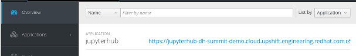

# Module - 4 : Analytics on Metrics Data

!!! Summary "Module Agenda"
    - **In this module, you will be doing basic analysis of a Metrics data set from Prometheus**

!!! example "Prerequisite"
    - **You need to have completed Modules 1-3 before beginning this module**

- The instructions for this excercise are available as Juypter Notebook (``.ipynb``) that you can download from [here](https://raw.githubusercontent.com/ksingh7/data-show/master/data-show-test-drive/Ceph_Data_Show_Lab_1.ipynb)

- An active JupyterHub instance is required to open this notebook. Use the JupyterHub application that you have deployed in module-2. Login to the OpenShift Container Platform Console and click on the JupyterHub application endpoint URL from the Overview screen.  It is the HTTP link located to the right of the screen.

- Use the following credentials to login into the JupyterHub application
User Name : ``user1``
Password  : ``79e4e0``  

- Select ``Start My Server``

- Select the ``s2i-spark-scipy-notebook:3.6`` notebook image

- Click ``Spawn`` and wait for your notebook server to start, this may take a minute

- Once the notebook server has started, you will see a folder view of the notebook file system

- Click the ``Upload`` button to the right  

- Find the Ceph_Data_Show_Lab_1.ipynb downloaded at the start of this module and upload it to the notebook

- Click on the ``Upload`` button to finish uploading the notebook to JupyterHub  

- Select the Ceph_Data_Show_Lab_1.ipynb notebook to begin analyzing the data

- In the section ``Analysing data using Spark``, replace the fs.s3a.endpoint value with the DNS or IP address of your Ceph cluster

- Select the first cell (the beginning of the notebook) and click the ``Run`` button in the toolbar on each cell, stepping through the notebook and its results  

!!! summary "End of Module"
    **We have reached the end of Module-4. In this module, you downloaded a sample Jupyter notebook exercise, uploaded it to JupyterHub and used it to analyze Prometheus data stored in Ceph. In the next module you will use machine learning libraries to train a model to detect the sentiment of a customer trip report.**