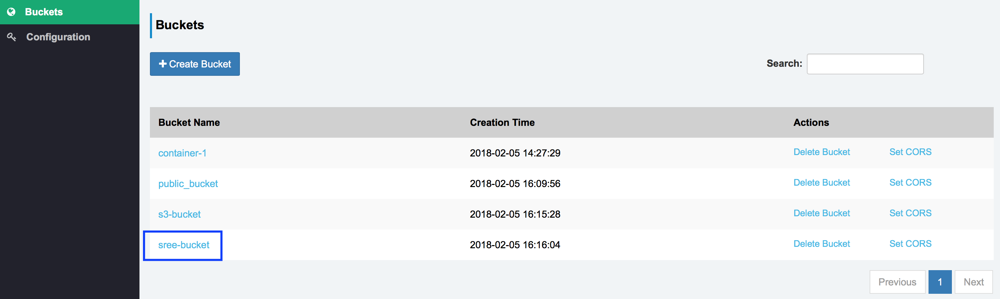

# Module - 4 : Ceph Object Storage Provisioning

!!! Summary "Module Agenda"
    - **In this module you will learn how to configure object storage using the Ceph RADOS Gateway (RGW) protocol**
    - **You will then use Ceph for Object Storage over S3 and SWIFT APIs**
    - **Finally, you will configure a Sree GUI S3 Browser to access Ceph Object Storage via the S3 API**
    - **By the end of this module, you will have an understanding of Ceph Object Storage.**
    
- From your workstation login to the ``ceph-admin`` node as user **``student``** [(Learn how to Login)](https://red-hat-storage.github.io/RHCS_Test_Drive/#starting-the-lab)

```
ssh student@<IP Address of ceph-admin node>
```

!!! example "Prerequisite"
    - **This module is independent of the other modules. If you intend to follow this module, please make sure that you have a running Ceph cluster before you begin.**
    - **You could setup a Ceph cluster using either of these two methods
    1) Follow the hands-on instructions in Module-2 and deploy the Ceph cluster
    2) From ``ceph-admin`` node, execute the following script to setup a Ceph cluster  
       ``sh /home/student/auto-pilot/setup_ceph_cluster.sh ``**
    - **Once you have a running Ceph cluster you will be ready to continue with this module.**
    - **You must run all the commands using user ``student`` on the ``ceph-admin`` node, unless otherwise specified.**

## Introduction

The Ceph object gateway, also know as the RADOS gateway (RGW), is an object storage interface built on top of the librados API to provide applications with a RESTful gateway to Ceph storage clusters. 

To access Ceph over object storage interfaces i.e. via ``swift`` or ``s3`` APIs, we need to configure Ceph RGW. In this module we will configure the ``ceph-admin`` node as Ceph RGW and verify ``s3`` and ``swift`` client access from ``client-node1`` 

## Setting up Ceph Rados Gateway

- Visit the ``ceph-ansible`` main configuration directory

```
cd /usr/share/ceph-ansible/group_vars/
```

- In this directory you will find the ``all.yml`` configuration file which has **already been pre-populated for you** to avoid any typographical errors. Let's review this file to better understand the Ceph RGW configuration parameters.

```
cat all.yml
```

- ``all.yml`` file configures Ceph RGW for
    - Port
    - Number of concurrent threads
    - RGW interface
    - RGW DNS name (required for s3 style bucket access)

```
...
...
radosgw_civetweb_port: 80
radosgw_civetweb_num_threads: 512
radosgw_civetweb_options: "num_threads={{ radosgw_civetweb_num_threads }}"
radosgw_interface: eth0
radosgw_dns_name: "ceph-admin"
...
...
```

- Add Ceph RGW host to your Ansible inventory file by editing the ``/etc/ansible/hosts`` file

```
sudo vim /etc/ansible/hosts
```

- Add the following section to your ``/etc/ansible/hosts`` file

```
[rgws]
ceph-admin
```

- To start deploying Ceph RGW, switch your directory to the ``ceph-ansible`` root

```
cd /usr/share/ceph-ansible
```


- Run the ``ceph-ansible`` playbook and limit it to ``rgw`` 

```
time ansible-playbook site.yml --limit  rgws
```

!!! tip
    Ansible is idempotent. If it is run multiple times, it has the same effect as running it once. Therefore, there is no harm in running it again. Configuration changes will not take place after its initial application.

- Once your Ansible playbook run has finished, ensure there are no failed items under ``PLAY RECAP`` 

- Allow user ``student`` to access the Ceph cluster

```
sudo chown -R student:student /etc/ceph
```

- Verify ``ceph-radosgw`` service is running on ``ceph-admin`` . Also make note of the port number it's running on. It must be on port 80.

```
sudo systemctl status ceph-radosgw@rgw.ceph-admin.service ; 
sudo netstat -plunt | grep -i rados ;
```

- To use Ceph as an Object Storage cluster, we first need to create ``S3`` and ``swift`` users

- Create a RGW user for ``S3`` access 

```
sudo radosgw-admin user create --uid='user1' --display-name='First User' --access-key='S3user1' --secret-key='S3user1key'
```

- Create RGW subuser for ``swift`` access

```
sudo radosgw-admin subuser create --uid='user1' --subuser='user1:swift' --secret-key='Swiftuser1key' --access=full
```

!!! success
    At this point, you have Ceph RGW installed and configured, and you have created S3 and Swift users. In the next section, you will learn how to access Ceph object storage using ``S3`` and ``Swift`` clients.

## Access Ceph Object Storage using Swift API

- To save time, ``python-swiftclient`` cli has already been installed on ``ceph-admin`` node

- Using Swift CLI, create a swift container (aka bucket) named ``container-1`` and then list it

```
swift -A http://ceph-admin/auth/1.0  -U user1:swift -K 'Swiftuser1key' post container-1 ; 
```

```
swift -A http://ceph-admin/auth/1.0  -U user1:swift -K 'Swiftuser1key' list
```

- Create a dummy file and then upload it to ``container-1`` using swift

```
cd /tmp ; base64 /dev/urandom | head -c 10000000 > dummy_file1.txt ; 
```

```
swift -A http://ceph-admin/auth/1.0  -U user1:swift -K 'Swiftuser1key' upload container-1 dummy_file1.txt
```

- List ``container-1`` to verify the file is stored

```
swift -A http://ceph-admin/auth/1.0  -U user1:swift -K 'Swiftuser1key' list container-1; 
```

!!! success
    Easy, right? So you have just learned how to use Ceph for Object Storage using swift APIs. 

## Access Ceph Object Storage using S3 API

The Ceph object storage cluster can be accessed by any client that supports ``S3`` API access.  In this section we will use ``s3cmd`` which has already been installed on the ``ceph-admin`` node.

- To use Ceph with S3-style subdomains (e.g., bucket-name.domain-name.com), you need to add a wildcard to the DNS record of the DNS server you use with the ceph-radosgw daemon. We will rely on ``dnsmasq`` which is a lightweight DNS server and has already been installed and configured on the ``ceph-admin`` node

- Next, we shall configure ``s3cmd`` on ``ceph-admin`` node

```
s3cmd --access_key=S3user1 --secret_key=S3user1key --no-ssl --host=ceph-admin --host-bucket="%(bucket)s.ceph-admin" --dump-config > /home/student/.s3cfg
```

- Test Ceph object storage via S3 protocol by listing buckets using ``s3cmd``. It should list buckets that you have created using ``swift`` in the last section 

```
s3cmd ls
```

- Create a new bucket and list 

```
s3cmd mb s3://s3-bucket ; 
```

```
s3cmd ls
```

- Create a dummy file and upload to ``s3-bucket`` via S3 API

```
cd /tmp ; base64 /dev/urandom | head -c 10000000 > dummy_file2.txt ;
```

```
s3cmd put dummy_file2.txt s3://s3-bucket ; 
```

```
s3cmd ls s3://s3-bucket
```

- Now, create a publicly accessible Ceph S3 bucket

```
s3cmd mb s3://public_bucket --acl-public
```

- Add content (Image File) to the S3 public bucket

```
s3cmd put --acl-public  /home/student/Red_Hat_Tower.jpg s3://public_bucket 
```

- Add content (Video File) to the S3 public bucket

```
s3cmd put --acl-public /home/student/Red_Hat_Ceph_Storage.mp4 s3://public_bucket
```

- Next, let's view this public content directly from your browser

- To view the image file, update the following URL with the public IP address of your ``ceph-admin`` node and copy this to your browser

```
http://<Public_IP_of_Ceph_Admin_Node>/public_bucket/Red_Hat_Tower.jpg
```

- To stream video directly from Ceph S3 public bucket, again, update the URL below with the public IP address of your ``ceph-admin`` node and copy the result to your browser

```
http://<Public_IP_of_Ceph_Admin_Node>/public_bucket/Red_Hat_Ceph_Storage.mp4
```

- Finally, let's use an Open Source object storage GUI browser, [Sree](https://github.com/ksingh7/Sree), to access Ceph Object Storage using the S3 API. For simplicity, Sree has been configured on your ``ceph-admin`` node and is running on port ``5000``.

- To open the Sree Object Storage browser, update the following URL with your ``ceph-admin`` node's public IP addresss and point your browser to

```
http://<Public_IP_of_Ceph_Admin_Node>:5000
```

- Let's configure Sree to access Ceph S3 by providing the following details in the configuration section (as shown in the screen shot)

```
Ceph S3 Endpoint : http://<Public_IP_of_Ceph_Admin_Node>
Access Key ID : S3user1
Access Key ID : S3user1key
```


- Once you have Sree configured with Ceph S3 endpoints and keys, click on the buckets section to list/create new buckets from the Sree object storage browser


!!! note
    Browsing buckets upon which Cross-Origin Resource Sharing (CORS) has not been set could result in a "Network Error". To avoid such errors, set CORS on the bucket either through the Sree web interface or the S3cmd CLI. It's worth noting that buckets created through the Sree web interface have CORS set by default and are browsable. Learn more about [CORS](https://en.wikipedia.org/wiki/Cross-origin_resource_sharing).

- Let's create a new bucket, ``sree-bucket`` , from the Sree Object Storage browser 



!!! summary "End of Module"
    **We have reached the end of Module-4. In this module, you have learned to use the Ceph cluster for object storage using S3 and Swift APIs. In the next module, you will learn to use Ceph storage as a distributed file system.**
