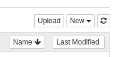

# Module - 5 : ML using Jupyter Notebooks on Ceph

!!! Summary "Module Agenda"
    - **In this module, you will be creating a model using data stored in Ceph to detect the sentiment of customer trip reports, and uploading the trained model back to Ceph**

!!! example "Prerequisite"
    - **You need to have completed Modules 1-4 before beginning this module**

- The instructions for this excercise are available as Juypter Notebook (``.ipynb``) that you can download from [here](https://raw.githubusercontent.com/ksingh7/data-show/master/data-show-test-drive/Ceph_Data_Show_Lab_2.ipynb)

- An active JupyterHub instance is required to open this notebook. Use the same JupyterHub application from module 4.

- Use the following credentials to login into the Jupyter Notebook
User Name : ``user1``
Password  : ``79e4e0``

- Go back to the JupyterHub dashboard by clicking on the JupyterHub logo in the upper left

- Click the ``Upload`` button to the right  

- Find the Ceph_Data_Show_Lab_2.ipynb downloaded at the start of this module and upload it to JupyterHub

- Click on the ``Upload`` button to finish uploading the notebook to JupyterHub  

- Select the Ceph_Data_Show_Lab_2.ipynb notebook to begin building a model for machine learning

- In the section ``Access data using Spark``, replace the fs.s3a.endpoint value with the DNS or IP address of your Ceph cluster

- Select the first cell (the beginning of the notebook) and click the ``Run`` button in the toolbar on each cell, stepping through the notebook and its results 

!!! summary "End of Module"
    **We have reached the end of Module-5. In this module, you created a machine learning model using data stored in Ceph and uploaded the model to Ceph for future use.**
