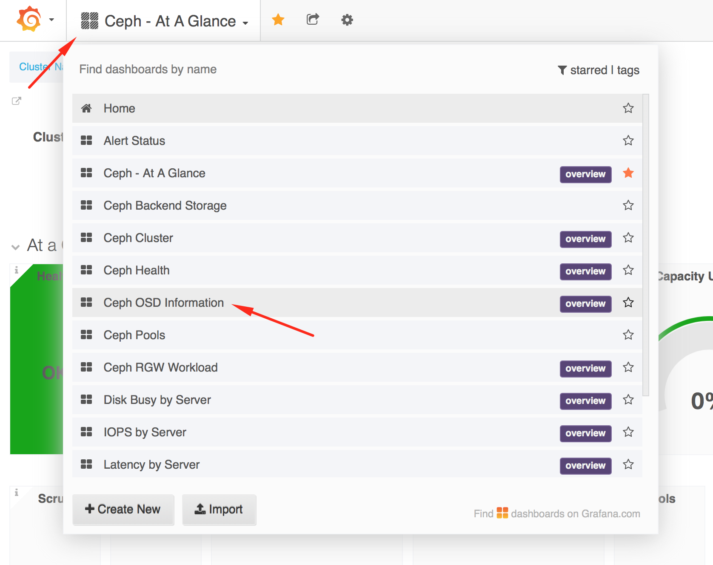
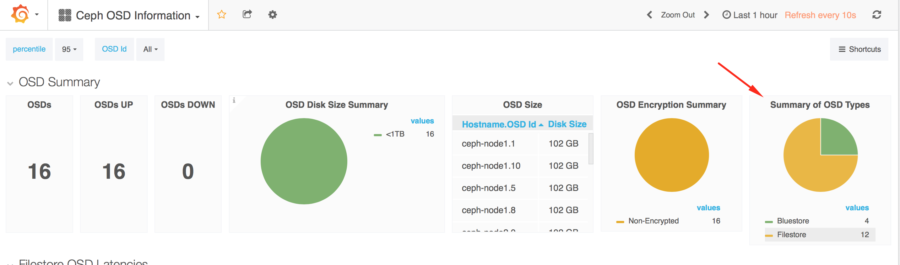

# Module - 6 : Ceph Administration

!!! Summary "Module Agenda"
    - **In this module you will perform Ceph Day-2 administration tasks, such as cluster monitoring, scaling out, etc.**
    - **You will also learn how Filestore and Bluestore OSD can coexist seamlessly in the same Ceph cluster**

- From your workstation login to the ``ceph-admin`` node as user **``student``** [(Learn how to Login)](https://red-hat-storage.github.io/RHCS_Test_Drive/#starting-the-lab)

```
ssh student@<IP Address of ceph-admin node>
```

!!! example "Prerequisite"
    - **This module is independent of the other modules. If you intend to follow this module, please make sure that you have a running Ceph cluster before you begin.**
    - **You could setup a Ceph cluster using either of these two methods
    1) Follow the hands-on instruction in Module-2 and deploy the Ceph cluster
    2) From ``ceph-admin`` node, execute the following script to setup a Ceph cluster  
       ``sh /home/student/auto-pilot/setup_ceph_cluster.sh ``**
    - **Once you have a running Ceph cluster, you will be ready to continue with this module.**
    - **You must run all the commands using user ``student`` on the ``ceph-admin`` node, unless otherwise specified.**

## Scale-Out a Ceph Cluster

Ceph is a distributed storage system designed to scale to hundreds of petabytes. In Module-2 you deployed a 3 OSD node (12 OSDs) Ceph cluster. In this section you will scale out your Ceph cluster by adding a new OSD node (4 OSDs) to it.

- Before we begin to add a new node to the cluster, make sure OS, SSH keys and networking is properly setup. In our case we already have the new node ``ceph-node4`` setup correctly.

- Starting with RHCS 3.0, a new OSD storage back-end has been introduced in Tech-Preview known as BlueStore.

!!! tip
    OSD BlueStore is a new back end for the OSD daemons. Compared to the currently used FileStore back end, BlueStore allows for storing objects directly on the block devices without any file system interface, which improves the performance of the cluster.

- To demonstrate that both Filestore (the current OSD backend) and Bluestore (the new OSD backend) can reside in the same cluster, we shall add ``ceph-node4`` as a Bluestore node.

- Edit Ansible inventory file ``/etc/ansible/hosts`` 

```
sudo vim /etc/ansible/hosts
```

- Add the host name of the new node under ``[osds]`` section as shown below.

```
[osds]
ceph-node4
```

- Next edit the ceph-ansible configuration file and change the OSD ``osd_objectstore`` backend from filestore to bluestore.

```
sudo sed -i 's/filestore/bluestore/' /usr/share/ceph-ansible/group_vars/all.yml
```

- To scale out the Ceph cluster, switch to the ceph-ansible root directory

```
cd /usr/share/ceph-ansible

```

- Before adding a node to your Ceph cluster, let's check OSD stat and OSD tree

```
ceph osd stat ; ceph osd tree
```

- As you can see, there are currently 12 OSDs in 3 OSD nodes. We shall use the ``ceph-ansible`` playbook to scale out the Ceph cluster 

```
time ansible-playbook site.yml
```

!!! tip
    Ansible is idempotent. If it is run multiple times, it has the same effect as running it once. Therefore, there is no harm in running it again. Configuration changes will not take place after its initial application.

- Once your Ansible playbook run has finished, ensure there are no failed items under ``PLAY RECAP`` 

- Allow user ``student`` to access the Ceph cluster

```
sudo chown -R student:student /etc/ceph
```

- Verify the changes in Ceph OSD stat and OSD tree. You should now see a total of 16 OSDs in 4 OSD hosts.

```
ceph -s
```

```
ceph osd stat
```

```
ceph osd tree
```

- Let's now add this new host (``ceph-node4``) to the Ceph Metrics Monitoring Dashboard. Switch to the Ceph Metrics Ansible directory and run the Ceph Metrics playbook

```
cd /usr/share/cephmetrics-ansible
```

```
time ansible-playbook playbook.yml
```

- At this point you have 
    - Scaled out your Ceph cluster from 3 nodes to 4 nodes (12 OSDs to 16 OSDs)
    - Configured OSDs on the new node as Bluestore Objectstore
    - Observed that Filestore and Bluestore OSDs are co-existing on the same cluster
    - Added the new node to the Ceph Monitoring Dashboard

- To check OSD summary, go to ``Ceph OSD Information`` panel 

[](images/module_6_ceph_dashboard_1.png)

- Check the ``Summary of OSD Types`` 

[](images/module_6_ceph_dashboard_2.png)

!!! summary "End of Module" 
    **We have reached the end of Module-6. In this module you have learned how to add nodes to a Ceph cluster, configured Bluestore OSDs in a cluster co-existing with Filestore OSDs, and add the new node to the Ceph Monitoring Dashboard. This concludes the Red Hat Ceph Storage 3 Test Drive. Additional modules will be added as new features are released, so please visit again!**